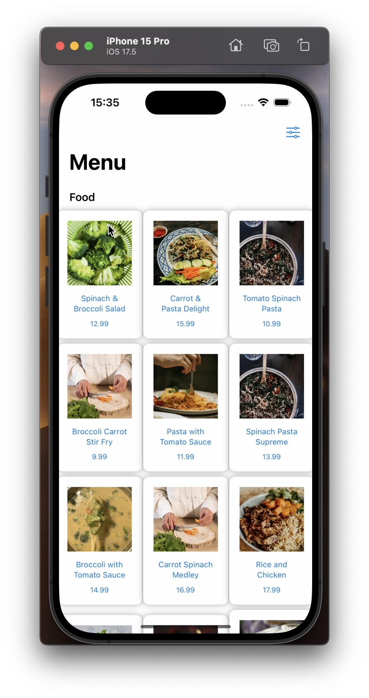
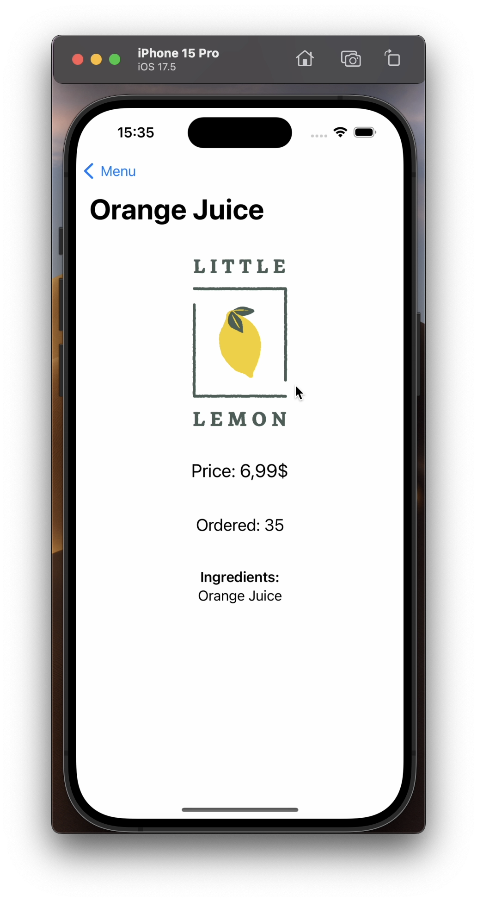
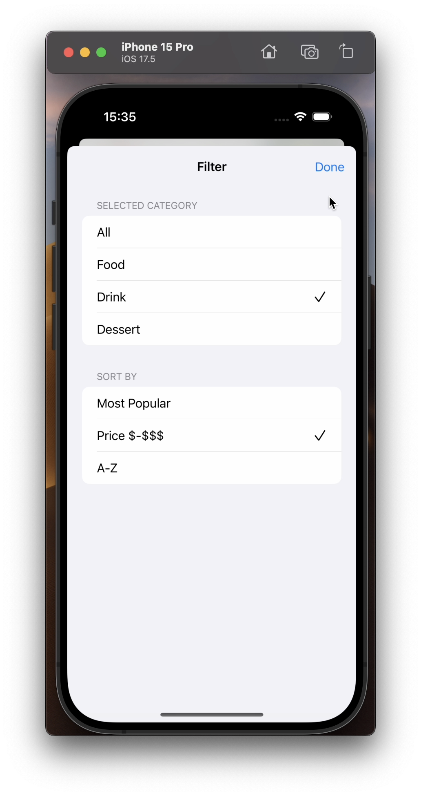

# Little Lemon Menü Uygulaması 🍋

## Overview
Little Lemon Menü Uygulaması is an iOS application built using SwiftUI, designed to showcase a restaurant's menu. The app features categorized menu items, sorting options, and detailed views for each menu item.

## Features
- **Categorized Menu Items**: Easily browse through food, drinks, and desserts.
- **Sorting Options**: Sort menu items by popularity, price, or alphabetically.
- **Detail Views**: Tap on a menu item to see detailed information including ingredients and price.

## Technologies Used
- **SwiftUI**: For building a responsive and modern user interface.
- **MVVM Architecture**: For maintaining a clean and organized codebase.
- **Mock Data**: Used for demonstrating menu items and their details.

## Screenshots




## Getting Started
To get a local copy up and running follow these simple steps.

### Prerequisites
- Xcode 12 or later
- Swift 5.3 or later

### Installation
1. Clone the repo
   ```sh
   git clone https://github.com/AlleyArda/LittleLemonMenu.git
